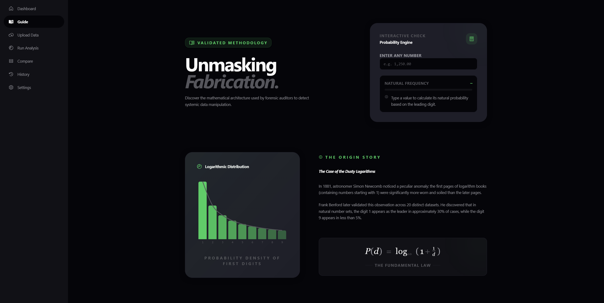
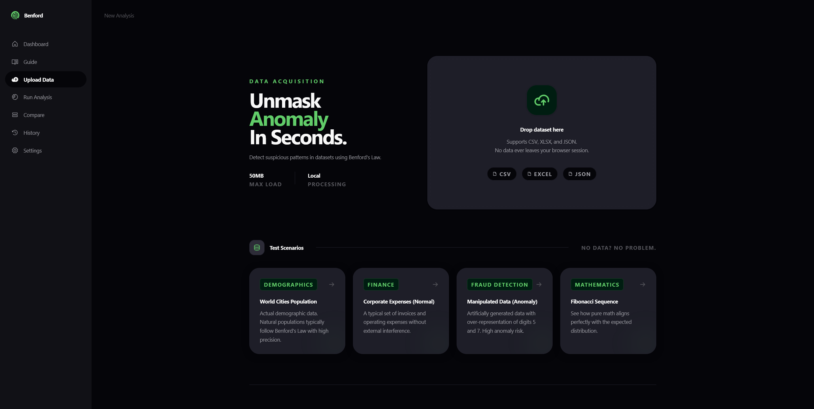
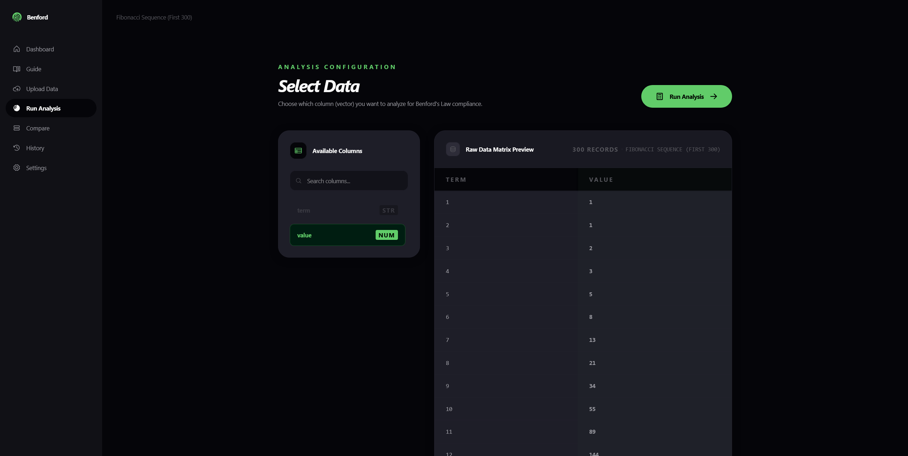
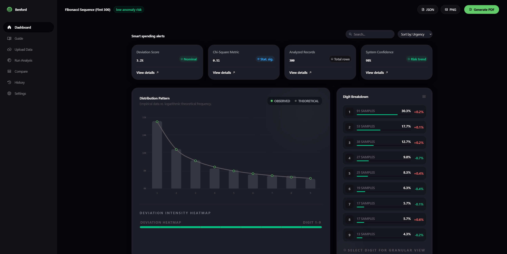

# Benford Law Visualizer

Web app for detecting suspicious numeric patterns using Benford's Law.

App lets you upload a dataset, choose a numeric column, run first-digit distribution analysis, compare observed values with the theoretical Benford distribution, and export the result as JSON, PNG, or PDF.

Live demo: [https://nubet.github.io/benford-law-visualizer/](https://nubet.github.io/benford-law-visualizer/)

## What you get

- **Interactive Benford guide**  
  Learn what Benford's Law is, why first digits follow a logarithmic distribution, and test single values in the probability engine.

- **Dataset upload**  
  Import local data files directly in the browser.

- **Supported file formats**  
  Analyze datasets from:
  - CSV
  - XLS / XLSX
  - JSON

- **Column-based analysis flow**  
  Select a numeric column from the uploaded dataset and preview raw rows before running the analysis.

- **Benford distribution dashboard**  
  Compare observed first-digit frequencies against the theoretical Benford distribution.

- **Anomaly scoring**  
  Review deviation score, chi-square metric, analyzed record count, and risk classification.

- **Digit breakdown**  
  Inspect each leading digit separately with sample count, observed percentage, and deviation.

- **Built-in sample datasets**  
  Try the app without uploading data using predefined scenarios:
  - World Cities Population
  - Corporate Expenses
  - Manipulated Data
  - Fibonacci Sequence

- **Analysis history**  
  Previous results are stored locally in the browser and can be revisited later.

- **Dataset comparison**  
  Compare two saved analysis results from history and inspect distribution differences.

- **Export tools**  
  Export analysis results as:
  - JSON
  - PNG
  - PDF

- **Configurable analysis settings**  
  Adjust sensitivity level and choose how negative values should be handled.

## How the analysis works

The app extracts the first significant digit from every valid numeric value in the selected column.

It then compares the observed digit frequency with Benford's theoretical distribution:
```
text
P(d) = log10(1 + 1 / d)
```
where `d` is a digit from `1` to `9`.

The analysis produces:

- observed count per digit,
- observed frequency per digit,
- theoretical Benford frequency,
- deviation between observed and expected values,
- chi-square score,
- global deviation score,
- anomaly risk level.

## Data and privacy

All parsing and analysis happens locally in the browser.

Uploaded datasets are not sent to any backend service. The app stores only analysis history and settings in browser `localStorage`.

## Tech stack

- **Framework**: React + Vite
- **Language**: TypeScript
- **Styling**: Tailwind CSS

- **Charts**: Recharts
- **File parsing**:
  - PapaParse for CSV
  - SheetJS / XLSX for Excel files
- **Exports**:
  - jsPDF
  - html2canvas
  - modern-screenshot
- **Animations**: Framer Motion
- **Deployment**: GitHub Pages

## Project structure

- `src/pages/` - app screens and routes
- `src/components/` - shared layout, UI, and chart components
- `src/services/` - Benford analysis, file parsing, mock datasets, and export logic
- `src/store/` - global app state and local persistence
- `src/types/` - TypeScript domain types
- `src/utils/` - analysis settings helpers and data handling utilities
- `docs/images/` - README screenshots
- `public/` - static assets

## Quick start

### Requirements

- Node.js
- npm

### 1) Install dependencies
```
bash
npm install
```
### 2) Start development server
```
bash
npm run dev
```
Then open the local URL shown in the terminal.

### 3) Build production version
```
bash
npm run build
```
### 4) Preview production build locally
```
bash
npm run preview
```
## Deployment to GitHub Pages

The project is configured for GitHub Pages deployment with `gh-pages`.

### Deploy
```
bash
npm run deploy
```
This runs the production build first and publishes the `dist/` directory to GitHub Pages.

### Deployment URL
```
text
https://nubet.github.io/benford-law-visualizer/
```
## Available scripts

- `npm run dev` - start Vite development server
- `npm run build` - run TypeScript build and create production bundle
- `npm run preview` - preview production build locally
- `npm run deploy` - build and publish to GitHub Pages

## Notes

- Benford's Law is most useful for naturally occurring, multi-scale numeric datasets. It should be treated as an anomaly signal, not as final proof of fraud.

## Screenshots

| Screen | Preview                                                                            | Caption |
| --- |------------------------------------------------------------------------------------| --- |
| Guide |                  | Interactive explanation of Benford's Law and first-digit probability. |
| Upload data |      | Upload CSV, Excel, or JSON files, or start from a sample dataset. |
| Select data |  | Choose the numeric column and preview records before analysis. |
| Analysis result |  | Distribution chart, anomaly metrics, and per-digit breakdown. |
